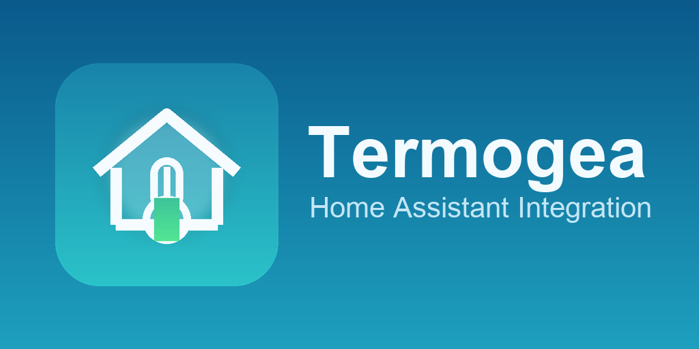

# Home Assistant Termogea

Custom integration Home Assistant per controllare e configurare impianti **Termogea** con persistenza nativa, policy per presenza persone, sensori locali e schedulazione settimanale.



## Repository

- GitHub owner: `Cobracco`
- Repository target: `home-assistant-termogea`
- Tipo: custom integration Home Assistant

## Funzionalita

- login locale verso il controller Termogea
- entita `climate` per zona
- configurazione persistente via UI Home Assistant
- bootstrap iniziale automatico da configurazione reale della centralina
- CRUD zone dalla UI dell'integrazione
- associazione persone e sensori di presenza per zona
- preset persistenti:
  - comfort
  - eco
  - away
  - night
  - inactive/off
- fasce orarie settimanali persistenti
- configurazioni stagionali separate (estate/inverno) per setpoint globali e fasce orarie
- sensori di policy per debug e dashboard
- switch globale `Termogea Power` per accendere/spegnere tutto
- supporto umidita zona (se registro disponibile)
- import legacy da YAML

## Installazione manuale

1. Copia `custom_components/termogea` dentro la directory `custom_components` della tua configurazione Home Assistant.
2. Riavvia Home Assistant.
3. Vai in **Settings > Devices & Services > Add Integration**.
4. Cerca `Termogea`.

## Installazione via HACS

Il repository e strutturato come custom integration standalone con un solo dominio.

1. Apri HACS.
2. Vai su **Integrations**.
3. Aggiungi il repository personalizzato `https://github.com/Cobracco/home-assistant-termogea`.
4. Seleziona categoria `Integration`.
5. Installa `Termogea`.

## Configurazione

La configurazione primaria avviene dalla UI dell'integrazione:

- connessione controller
- parametri globali
- **gestione stagione** (cambio rapido tra `auto`, `inverno`, `estate`)
- fasce orarie
- zone
- persone assegnate
- sensori presenza
- preset zona
- mapping tecnico registri

### Gestione stagione

Dalla voce **"Gestione stagione"** nel menu principale delle opzioni e possibile impostare la modalita stagionale senza modificare gli altri parametri globali:

| Valore | Comportamento |
|--------|---------------|
| `auto` | Determina la stagione dal mese corrente (aprile–settembre = estate, ottobre–marzo = inverno) |
| `winter` | Forza la modalita inverno indipendentemente dal mese |
| `summer` | Forza la modalita estate indipendentemente dal mese |

La stagione attiva e visibile tramite il sensore `sensor.termogea_active_season`.

## Import legacy

Se hai un file `termogea_zones.yaml`, puoi importarlo:

- dalla UI di configurazione dell'integrazione
- oppure con il servizio `termogea.import_legacy_yaml`
- oppure forzare import completo da controller con `termogea.import_controller_config`

## Dashboard UI stile app

Nel repository e inclusa una dashboard Lovelace in stile Termogea:

- file: `dashboards/termogea_ui_style.yaml`
- docs: `dashboards/README.md`

Prerequisiti HACS frontend:

- `button-card`
- `auto-entities`

## Scheda Lovelace Termogea (repo separata)

La card Lovelace e stata separata dal backend integrazione.

Repository frontend HACS:

- `https://github.com/Cobracco/home-assistant-termogea-card`
- categoria HACS: `Dashboard`
- tipo card: `custom:termogea-zone-grid-card`

Esempio configurazione minima:

```yaml
type: custom:termogea-zone-grid-card
title: Zone Termogea
```

Con lista entita esplicita:

```yaml
type: custom:termogea-zone-grid-card
title: Zone Termogea
entities:
  - climate.termogea_zona_1_climate
  - climate.termogea_zona_2_climate
```

## Problemi Risolti

Risolti nelle ultime iterazioni (fino a `0.1.11`):

- errore `AttributeError: property 'config_entry' ... has no setter` nel flow opzioni
- migrazione connessione per evitare `KeyError: 'host'` in setup entry
- fallback host quando entry corrotta puntava al titolo (es. `pierini`) invece dell'IP
- avvio integrazione anche senza `termogea_zones.yaml` (YAML legacy ora opzionale)
- bootstrap iniziale da controller Termogea (`telegea.tar`) con import zone/soglie/schedule base
- nomi zona sincronizzati dal controller (no default `Termogea_zona_X_device` quando disponibili)
- salvataggio form policy zona separato dalla form mapping tecnico
- esposizione umidita corrente su climate e sensore dedicato per zona (quando mappata)

## Sviluppo

- validation workflow: `hassfest`
- issue templates GitHub inclusi
- `CODEOWNERS`, `CONTRIBUTING.md`, `SECURITY.md`, `SUPPORT.md` inclusi
- branding assets HACS/GitHub:
  - `icon.png`
  - `logo.png`

## Supporto

- Issues: [GitHub Issues](https://github.com/Cobracco/home-assistant-termogea/issues)
- Security: [SECURITY.md](SECURITY.md)
- Contributing: [CONTRIBUTING.md](CONTRIBUTING.md)
